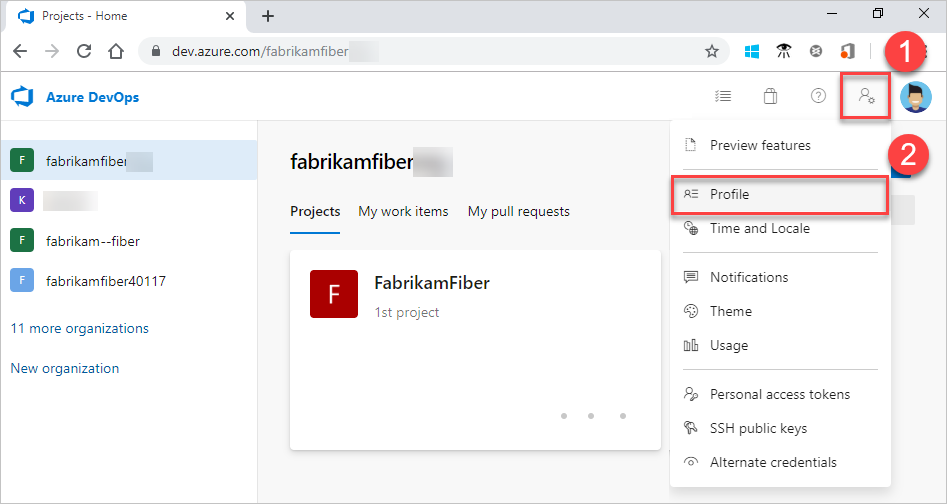
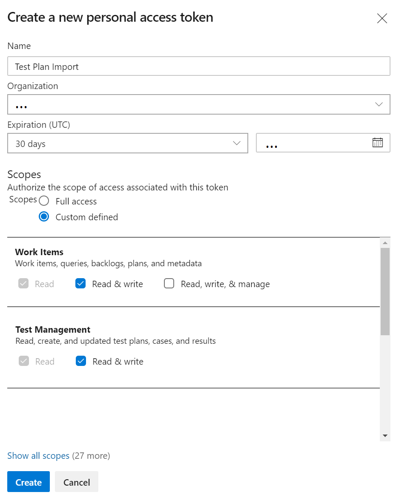

# Overview

Import test cases **with steps** from a CSV file into Azure DevOps

This is a workaround for the limitation of the [bulk work item import](https://docs.microsoft.com/en-us/azure/devops/boards/queries/import-work-items-from-csv)


# Getting Started

Clone this repository and run the following to activate the virtual environment and download dependencies

```
source env/bin/activate
pip install -r requirements.txt
```

You can then view how to run the script with the following command

```
$ python devops-testplan-import.py -h
usage: devops-testplan-import.py [-h] -o ORG -i PROJECT [-p PAT] -f FILENAME

optional arguments:
  -h, --help            show this help message and exit
  -o ORG, --org ORG     Azure DevOps Organisation, e.g dev.azure.com/{org}
  -i PROJECT, --project PROJECT
                        Project to import Work Items into
  -p PAT, --pat PAT     Personal access token for authentication
  -f FILENAME, --filename FILENAME
                        CSV file to import work items from
```

## Setting up Auth

In order for the script to be able to access your DevOps project you need to generate a token so Azure DevOps knows you are authorized make these changes.

1. Sign in to your organization in Azure DevOps `https://dev.azure.com/{yourorganisation}`
1. From your home page, open your user settings, and then select **Profile**.

1. Under Security, select Personal access tokens, and then select **+ New Token**.

1. Name your token (e.g *Test Plan Import*), select the organization where you want to use the token, choose a lifespan for your token (e.g 30 days) and select the **Work Items** and **Test Management** *Read & Write* scopes

1. When you're done, make sure to copy the token. You'll use this token as your password.


## Run the script again
Now try running the script again but this time setting your personal access token (PAT)

```
python devops-testplan-import.py -o "Organisation" -p "Token" -i "Project"
```

* **Token** is your PAT generated earlier
* **Organisation** is your organisation name from your DevOps URL `https://dev.azure.com/{yourorganization}`
* **Project** is the project you want to import the *Test Cases* into

## Importing from CSV

When you run the above, you will get another error indicating that the script doesn't know where to load the test cases to be imported from.

```sh
usage: devops-testplan-import.py [-h] -o ORG -i PROJECT [-p PAT] -f FILENAME
devops-testplan-import.py: error: the following arguments are required: -f/--filename
```

To fix this you must save your exported test cases as a CSV file accessible by this script and pass the path as an argument, for example:

```sh
python devops-testplan-import.py -o "Organisation" -p "Token" -i "Project" -f ./export.csv
```

# How it works

The script will:
* Iterate through all rows in the CSV file
* Extract the appropriate fields
* Generate a JSONPatchDocument representing a work item
* Add Steps as an embedded XML document within this
* Use the Azure DevOps Python API Client to create the new Work Item